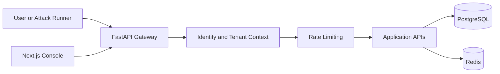
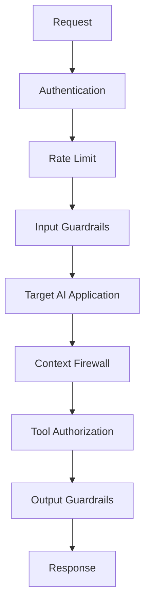
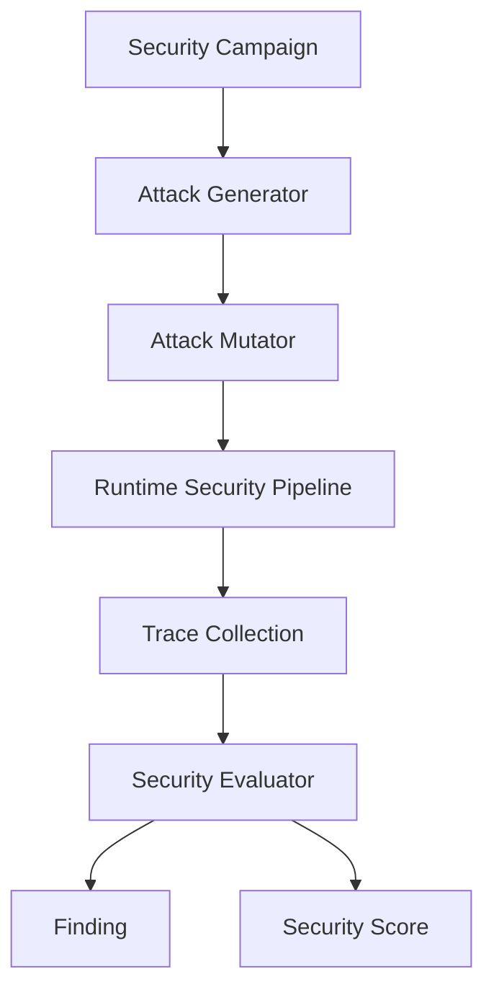

# AegisAI

AegisAI is a local, portfolio-grade AI application security and red-teaming platform. It is designed to demonstrate practical controls for prompt injection, jailbreaks, RAG poisoning, tool abuse, data leakage, policy enforcement, observability, and security scoring.

This repository is intentionally incremental. Milestone 1 builds the foundation: a FastAPI backend, tenant-aware persistence, authentication, rate limiting primitives, a Next.js security console, Docker Compose infrastructure, CI, and documentation. Later milestones add the vulnerable Enterprise Support Agent, runtime defenses, red-team campaigns, observability, and CI/CD security gates.

## Why AI Applications Need Security

LLM applications combine untrusted user input, retrieved documents, model reasoning, and tool execution. Traditional web security controls are still necessary, but they do not cover instruction hierarchy attacks, indirect prompt injection, excessive agency, or leakage from model-generated output. AegisAI models these risks as observable runtime and testing workflows.

## Architecture



Milestone 1 keeps Qdrant, Redpanda, Prometheus, and Grafana available in Docker Compose without pretending to use them before their product flows exist.

## Reduced Roadmap

1. Foundation: monorepo, local infrastructure, backend identity, persistence, first frontend shell, CI basics.
2. Secure Demo App: LLM provider abstraction, vulnerable Enterprise Support Agent, Qdrant-backed RAG, mock tools, runtime guardrails, policy evaluation, context firewall, tool authorization, and audit logs.
3. Red-Team Evaluation: attack taxonomy, generator, mutator, campaigns, traces, evaluator, findings, metrics, scoring, deterministic demo scenarios, and benchmark mode.
4. Observability Dashboard: OpenTelemetry spans, Prometheus metrics, Grafana dashboards, event streaming, dashboard pages, attack explorer, findings, policies, traces, and visual attack paths.
5. CI/CD Polish: security gate workflow, regression suites, threshold enforcement, final demo story, seed data, performance tuning, and UX polish.

## Runtime Security Flow



Only identity and rate-limit primitives exist in Milestone 1. Guardrails, context firewall, and tool authorization are added in Milestone 2.

## Red-Team Flow



The red-team engine arrives in Milestone 3. The important rule remains: attacks must pass through the same runtime path as real traffic.

## Current API

- `GET /health`: liveness.
- `GET /ready`: readiness.
- `GET /api/v1/me`: authenticated identity context.
- `GET /api/v1/applications`: tenant-scoped application list.
- `POST /api/v1/applications`: tenant-scoped application registration.

Development API keys:

- `dev-aegis-key`: `tenant-demo`
- `dev-other-key`: `tenant-other`

## Local Setup

```bash
cp .env.example .env
docker compose up --build
```

Services:

- Frontend: `http://localhost:3000`
- Backend: `http://localhost:8000`
- Prometheus: `http://localhost:9090`
- Grafana: `http://localhost:3001`
- Qdrant: `http://localhost:6333`

## Backend Development

Docker and CI use Python 3.12. This machine currently has Python 3.10, and the backend tests still run locally with compatible dependencies.

```bash
cd backend
pip install -e ".[dev]"
pytest -q
ruff check .
```

## Frontend Development

```bash
cd frontend
npm install
npm run lint
npm run typecheck
npm run build
```

## Database And Migrations

The first Alembic migration creates the core tables:

`users`, `tenants`, `applications`, `projects`, `policies`, `guardrails`, `attack_campaigns`, `attacks`, `attack_variants`, `attack_results`, `findings`, `traces`, `tool_calls`, `security_events`, and `evaluation_runs`.

Application code uses migrations in Docker. Local tests use isolated SQLite databases with automatic schema creation for speed.

## Testing

Current tests cover:

- Settings defaults.
- Authentication failures and success.
- In-memory rate limiting.
- Tenant-scoped application isolation.

## Limitations

- No LLM provider, support agent, RAG, tool execution, guardrail detector, attack runner, evaluator, security scoring, OpenTelemetry, or Grafana dashboard is implemented yet.
- The frontend shows real backend health and application state, while security metrics remain empty states until evaluation data exists.
- High-risk actions such as refunds and emails will be simulated locally in later milestones.

## Future Work

The next milestone should add the Enterprise Support Agent with a deterministic local LLM provider, Qdrant-backed documents, mocked tools, and intentionally configurable vulnerabilities so the runtime defenses have a real target to protect.
